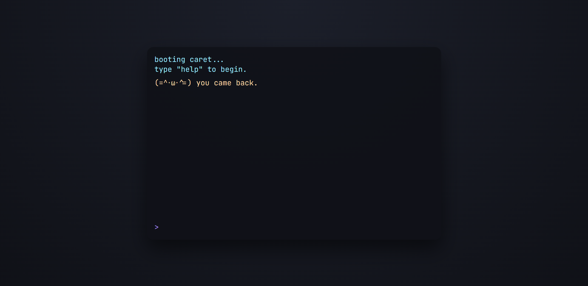

# caret

caret is a quiet terminal companion that lives between keystrokes.
type simple commands, check in occasionally, and let it change over time.

### commands

- `help` - list commands
- `status` - check caret’s state
- `feed`, `play`, `sleep`, `pet` - interact
- `rename <name>` - rename caret
- `clear` - clear the terminal

Some commands are not listed.

### notes
- time continues to pass while you’re away
- there is no win condition - it’s meant to idle

### preview

